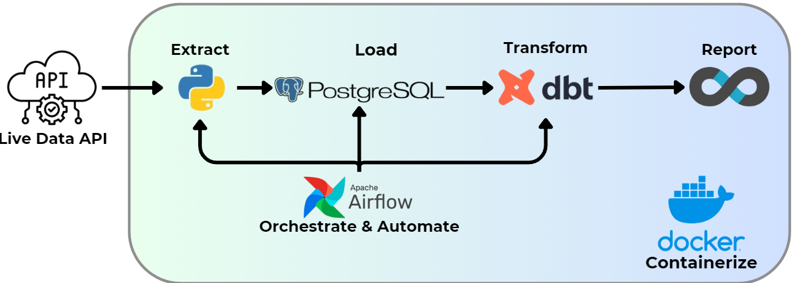

# End-to-End Data Pipeline Mastery: From Ingestion to Visualization with Airflow, dbt, PostgreSQL, and Superset on WSL


End-to-end automated data pipeline, designed to collect weather data, transform it, and make it available for analysis and visualization. Built with a modern data stack, this project demonstrates a robust ETL, ELT workflow.


---
## ✨  Key Highlights & Unique Value Proposition

* **Solve Data Problems:** Transform raw data into clean, reliable and analytics-ready models.
* **Modern Data Stack Integration:** Gained hands-on experience by integrating tools in Data Engineering(Airflow, dbt) and Business Intelligence (Superset).
* **WSL2 Optimization:** Ensuring high performance and compatibility.
* **ELT Workflow:**

  * **Extract & Load (Airflow):** Automated data ingestion from sources (API) into PostgreSQL.

  * **Transform (dbt):** Built structured data models, applied complex business logic, and ensured data quality using dbt tests.

  * **Visualize (Superset):** Created intuitive dashboards and charts, empowering end-users to explore insights flexibly.

* **Khả năng mở rộng:** Thiết kế module và linh hoạt, cho phép dễ dàng thêm nguồn dữ liệu, mô hình biến đổi, và dashboard mới trong tương lai.
* **Scalable & Modular Design:** The system's design allows for easy integration of new data sources, transformation logic, and dashboards.

---
## 🚀 Project Overview
This pipeline automates the process of:

- **Extracting** real-time weather data from WeatherStack API.

- **Loading** raw data into a PostgreSQL database.

- **Transforming** raw data into clean, structured models using dbt.

- **Orchestrating** the entire workflow with Apache Airflow.

- **Visualizing** the transformed data using Apache Superset.

The entire stack is containerized using Docker Compose for easy setup and management on a Windows 11 machine with WSL.
---


## 🏗️ Architecture

* Apache Aiflow: Powerfull workflow orchestrator managing DAGs for data ingestion and triggering transformation steps.
* dbt(data build tools): Uses SQL to define data models, run tests.
* PostgreSQL: An open-source relational database, serving as the DW for raw and transformed data models.
* Apache Superset: An open-source BI platform, providing an intuitive interface to build dashboards and explore data.
* Docker & Docker compose: Containerizes all components.

---

## 🛠️ Setup & Usage Guide
### Prerequisites
 * [Docker Desktop](https://www.docker.com/products/docker-desktop/)
 * [Git](https://git-scm.com/)
### 
1. **Clone repo:**
    ```bash
    git clone https://github.com/dnnnam188/Automated-Data-Pipeline.git
    cd repo
    cd weather_data_project
    ```
2. **Docker compose up:**
    ```bash
    docker-compose up -d
    ```
    Allow a few minutes for all containers to fully start.
3. **How to use**
* Apache Airflow: Access at http://localhost:8080.
  * Default Username is admin, password will appear in container. You can Ctrl + F and find password.
  * Enable and trigger dag.
* Apache Superset: Access at http://localhost:8088.
  * Default Username/Password: admin/admin
  * Connect database and add datasets(were created by dbt)
  * Explore the transformed data tables and dashboards in Superset.


